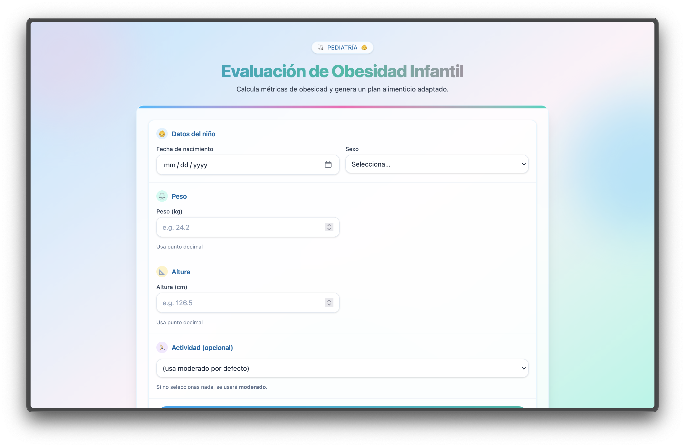
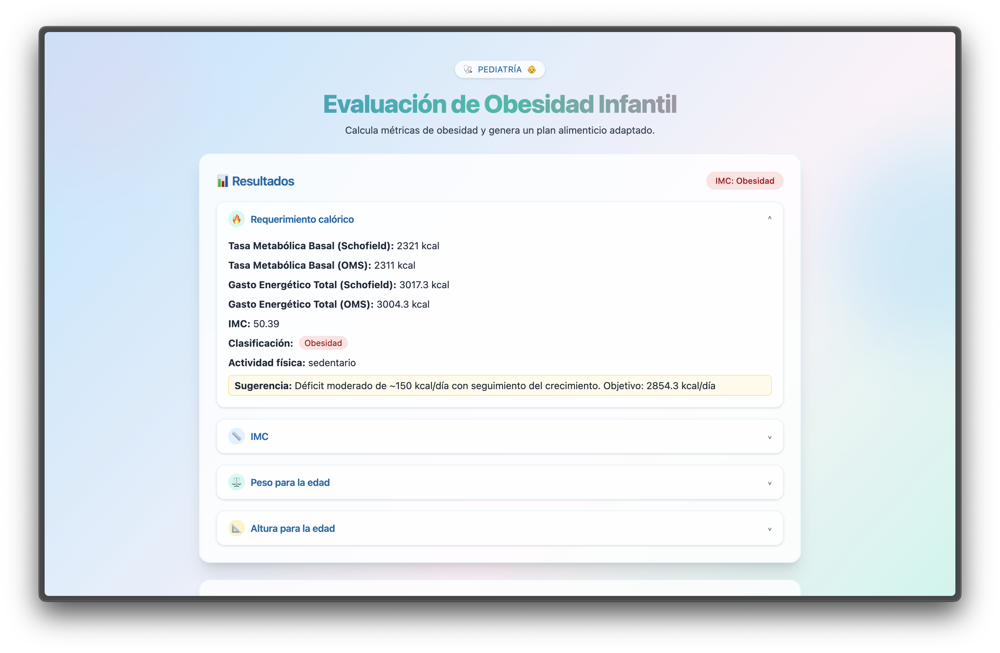
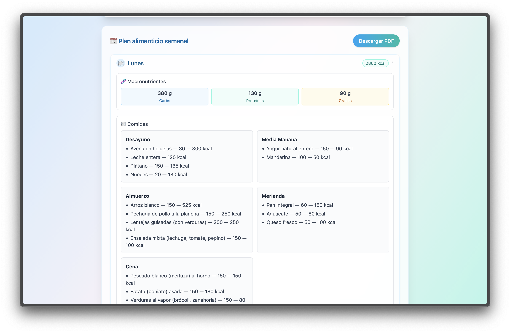

# Pediatric Obesity & Nutrition Evaluator

This is a web application built to assist pediatricians in evaluating a child's growth metrics and generating personalized weekly meal plans based on WHO standards. It is designed to be used by a healthcare professional (in this case, my mother) in clinical practice.

🧠 Improvements and refinements ongoing

### Features

Anthropometric Evaluation:

- Calculates BMI, weight-for-age, and height-for-age z-scores
- Classifies results using WHO growth standards
- Provides caloric needs using both Schofield and WHO equations

Weekly Meal Plan Generator:

- Uses Google's Gemini API to generate personalized 7-day meal plans
- Nutritional references adapted to the child’s age, sex, and classification
- Includes caloric and macronutrient breakdowns

Privacy-first Design:

- No user login or data persistence
- All calculations are performed locally or within a secure API session
- Designed for private use only (not publicly hosted)

### Screenshots

### Tech Stack

- Frontend: React (Vite)
- Backend: FastAPI (Python)
- LLM: Gemini 2.5 Flash
- Data: WHO LMS and BMI reference tables (cleaned CSVs)

### Built for a Real-World Use Case

This project was created specifically for my mother, a practicing pediatrician, to simplify her workflow when assessing nutritional needs and providing families with structured meal plans.

### Legal Notice

This app does not store any data and does not support user accounts. It is intended solely for private clinical use.
